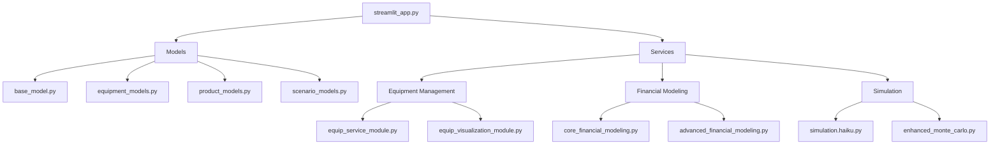

# Advanced Manufacturing Planner - Code Index

This document provides a comprehensive index of the codebase, explaining the purpose and functionality of each component.

## Core Application Files

- `streamlit_app.py` - Main Streamlit application with UI components and core functionality
- `main-app.py` - Alternative entry point with command-line interface support

## Models

Database models and schemas for the application:

- `models/base_model.py` - Base SQLAlchemy configuration and session management
- `models/equipment_models.py` - Equipment and capacity-related data models
- `models/product_models.py` - Product and pricing data models
- `models/scenario_models.py` - Scenario management models
- `models/financial_projections_model.py` - Financial projection and analysis models

## Services

Business logic and core functionality modules:

### Equipment Management
- `n1.1_equip_service_module.py` - Core equipment management services
- `n1.2_equip_visulaization_module.py` - Equipment visualization and reporting
- `n1.3_equip_expansion_module.py` - Equipment expansion planning
- `n1_equip_example_usage.py` - Usage examples for equipment services

### Financial Modeling
- `n2.1_core_financial_modeling.py` - Core financial calculations and projections
- `n2.2_advanced_financial_modeling.py` - Advanced financial analysis features

### Equipment Analysis
- `n3.1_equipment_models_and_vis.py` - Equipment modeling and visualization tools

### Simulation
- `n4.1_simulation.haiku.py` - Base simulation engine
- `n4.1_simulation.haiku_dupelong.py` - Extended simulation capabilities
- `n4.2_enhanced_monte_carlo.py` - Monte Carlo simulation implementation
- `n4.3_mc_example_script.py` - Example usage of Monte Carlo simulations

### Additional Services
- `n5.1_sales_service.py` - Sales forecasting and analysis
- `n6.1_gq_service.py` - Quality and governance services
- `n7.1_assumptions_service.py` - Business assumptions management

## Utilities

- `Utils/db-utils.py` - Database utility functions and helpers

## Documentation

- `complete_architecture.md` - Detailed system architecture documentation
- `requirements.md` - Project dependencies and requirements
- `project-structure.md` - Project organization and structure guide

## Module Dependencies

## Key Features by Module

### Equipment Management
- Equipment inventory tracking
- Capacity planning
- Utilization analysis
- Expansion planning

### Financial Modeling
- Revenue projections
- Cost analysis
- Profitability metrics
- Cash flow modeling

### Simulation
- Monte Carlo analysis
- Risk assessment
- Scenario modeling
- Sensitivity analysis

### Sales and Quality
- Sales forecasting
- Quality metrics
- Governance rules
- Compliance tracking

## Getting Started

For new developers:
1. Start with `streamlit_app.py` to understand the main application flow
2. Review the models in the `models/` directory to understand data structures
3. Explore the services in order (n1.x → n7.x) to understand business logic
4. Check example files (like `n1_equip_example_usage.py`) for usage patterns

## Contributing

When adding new features:
1. Follow the existing naming convention (nx.y_module_name.py)
2. Update this index file
3. Add example usage where appropriate
4. Update relevant documentation 